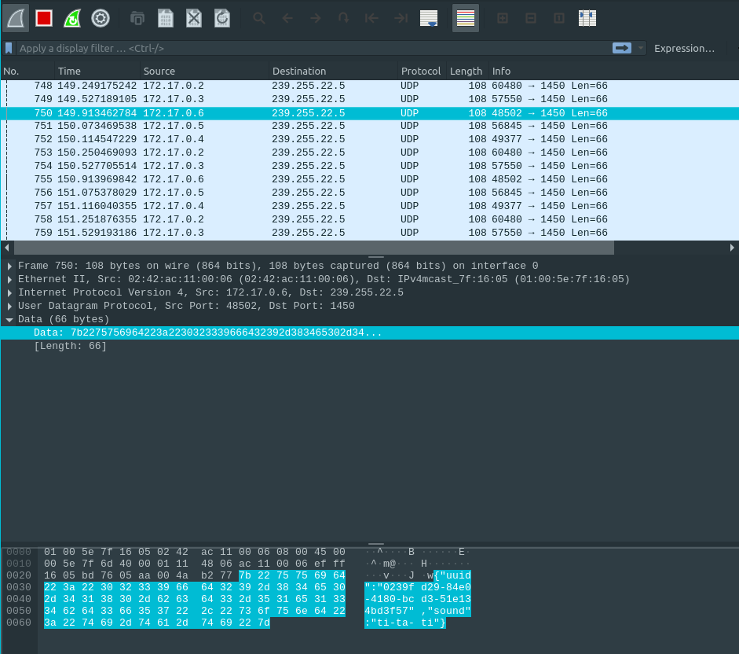

# RES_LABO5
## How it works
The auditor will listen to a UDP multicast ip:port. Everytime, he hears a musician playing, he will add the troubadour in his intern container which is containing active musicians. In addition, every second, the auditor will clean his container to keep only the one that he heard the past five seconds. It's also possible to etablish a TCP connection to get the musicians container of the auditor (in JSON format)

When creating a musician, we specify the instrument we want him to play. He will then send a UDP package every second containg his uuid (that as been generated when he has been created) and the sound his instrument (in JSON format). 

## Configuration

### Auditor  
These variables can be found in [`docker/image-auditor/src/config.js`](./docker/image-auditor/src/config.js)
| ENV. VARIABLE                           | DESC.                                                                          | VALUE        |
|-----------------------------------------|--------------------------------------------------------------------------------|--------------|
| NETWORK.udp.ip                          | Multicast address. We listen to Musician, that will broadcast on this address. | 239.255.22.5 |
| NETWORK\.udp.port                        | Same as ip. We need to have the same port on the Musician endpoint.            | 1450         |
| NETWORK\.tcp.port                        | TCP port where active musicians are sent. Used by the validation protocol.     | 2205         |
| AUDITOR_CONFIG\.clean_musicians_interval | Time in ms when we update our list of active Musician.                         | 1000         |
| AUDITOR_CONFIG\.max_musician_delay       | Time in ms, under which a Musician is considered as active.                    | 5000         |
| INSTRUMENTS                             | For each noise, the instrument that made it.				   | `{"ti-ta-ti":"piano","pouet":"trumpet","trulu":"flute","gzi-gzi":"violin","boum-boum":"drum"}` |

### Musician  
These variables can be found in [`docker/image-musician/src/config.js`](./docker/image-musician/src/config.js)
| ENV. VARIABLE                 | DESC.                                                                 | VALUE        |
|-------------------------------|-----------------------------------------------------------------------|--------------|
| NETWORK\.udp.ip                | Multicast address. We make music for anyone listening here.           | 239.255.22.5 |
| NETWORK\.udp.port              | We make music for anyone listening on the combinaison IP:PORT.        | 1450         |
| MUSICIAN_CONFIG\.play_interval | Delay between each sound a musician will emit a sound if he's active. | 1000         |
| INSTRUMENTS                   | For each instrument, the noise it produces.                           | `{"piano":"ti-ta-ti", "trumpet":"pouet","flute":"trulu","violin":"gzi-gzi","drum":"boum-boum"}`|

### Docker images
We have the following docker images. 
| NAME                          | DESC                                                         |
|-------------------------------|--------------------------------------------------------------|
| res/auditor                   | Docker image containing the **Auditor** nodejs application.  |
| res/musician                  | Docker image containing the **Musician** nodejs application. |

## Task 1 : design the application architecture and protocols. 
### How can we represent the system in an architecture diagram, which gives information both about the Docker containers, the communication protocols and the commands?
Here's a (simplified) schema representing the entities and how they communicate to each other.


As we can see, the end user chooses the instruments he wants the musician to play, when running the docker. Then, the musician emits a sound with the instrument thanks to *UDP*. The auditor listen on the same UDP port and can obtains the sound and determine the instrument used.

The validation block is kind of a "entité magique". We don't need to know what it does, but only how to communicate with it. And we communicate with it with *TCP* on the port 2205.
### Who is going to send UDP datagrams and when?
The musicians will send a UDP datagram every seconds.
### Who is going to listen for UDP datagrams and what should happen when a datagram is received?
The auditor will receive the UDP datagram and store the musician into a Map using the musician's uuid as key.
### What payload should we put in the UDP datagrams?
The musician wil send his uuid and the sound his instrument's making. 
eg:
```js
{
    uuid: "9b1deb4d-3b7d-4bad-9bdd-2b0d7b3dcb6d",
    sound: "pouet"
}
```
### What data structures do we need in the UDP sender and receiver? When will we update these data structures? When will we query these data structures?
Inside the UDP receiver/auditor: we use a Map with the uuid of the musician as key and the object as value which can contains the date of his last heard sound and the instrument his playing. Plus, a js object used as a dictionary (key => value) to store  the instrument and their sounds. (the ease the use we use the sound as key and the instrument name as value).

Inside the UDP sender / musician: we also use a js object as dictionary. But in this one, we use the name of the instrument as key (and the sound as value).  

## Task 2 : implement a "musician" Node.js application. 
### In a JavaScript program, if we have an object, how can we serialize it in JSON?
We can simply call the method `JSON.stringify(yourObject)`.
### What is npm?
As its name states it (Node Package Manager), npm is a dependency manager for NodeJs.
npm is to Javascript what Meaven is to Java and what Composer is to PHP.
### What is the npm install command and what is the purpose of the --save flag?
The `npm install command` can have two purposes. If you use it without arguments it will simply install the needed packages specified into the `package.json` (which you be presents where you execute the command). If you specified a parameter after the command eg:`npm install trash`, it will install the package [trash](https://www.npmjs.com/package/trash). It will also add the dependency into the package.json for the next installations.
According to this [Stackoverflow post](https://stackoverflow.com/a/19578808/7657805), the flag `--save` is no more useful. It was used to add the package into the package.json but as previously mentioned, it's automacally done when using npm install without flag

https://docs.npmjs.com/cli/v7/commands/npm-install#save
### How can we use the https://www.npmjs.com/ web site? 
To find packages or to read the docs.    
### In JavaScript, how can we generate a UUID compliant with RFC4122 ?  
We use the package [uuid](https://www.npmjs.com/package/uuid) that seems compliant with the [RFC4122](https://www.ietf.org/rfc/rfc4122.txt).
### In Node.js, how can we execute a function on a periodic basis?
With `setInterval(callback, interval)` that execute the callback function each ìnterval milliseconds.
### In Node.js, how can we emit UDP datagrams?
We can use sockets from [dgram](https://nodejs.org/api/dgram.html). 
### In Node.js, how can we access the command line arguments?
We can acces the command line arguments with `process.argv[<idx>]`. 
Please note that 
 - `<idx> = 0` is the path to nodejs
 - `<idx> = 1` is the file ran
 - `<idx> > 1` are the arguments 
So, if we run `node musician.js didgeridoo`, process.argv contains the following sequence :
```
0: /usr/local/bin/node
1: path/to/musician.js
2: didgeridoo
```

## Task 3: package the "musician" app in a Docker image. 
### How do we define and build our own Docker image?
We use [Dockerfiles](https://docs.docker.com/engine/reference/builder/) to build images and run them as container.
### How can we use the ENTRYPOINT statement in our Dockerfile?
To specify the command to launch when the docker container is ready. For instance, if we want to run our node app. We can do `ENTRYPOINT ["node", "/opt/app/app.js"]`.
### After building our Docker image, how do we use it to run containers?
We can use the command `$ docker run <image/name>`.
### How do we get the list of all running containers?
We can use the command `$ docker ps`
### How do we stop/kill one running container?
We can kill a container by using the command `$ docker kill <container/name>` the container name can be found by using the `$ docker ps` command
### How can we check that our running containers are effectively sending UDP datagrams?
We can open Wireshark and to read the sent packets in the docker network. 
. As we can see in the highlighted part (bottom of the image), the data of the musician are present.

## Tâche 4: implement an "auditor" Node.js application. 
### With Node.js, how can we listen for UDP datagrams in a multicast group?
We can use where udpSocker has been created with `dgram.createSocket("udp4")`
```js
udpSocket.bind(NETWORK.udp.port, () => {
    udpSocket.addMembership(NETWORK.udp.ip);
});
```

### How can we use the Map built-in object introduced in ECMAScript 6 to implement a dictionary?
We use the [Map](https://developer.mozilla.org/en-US/docs/Web/JavaScript/Reference/Global_Objects/Map) object : 
` new Map([iterable])`.


### How can we use the Moment.js npm module to help us with date manipulations and formatting?
MomentJs provides useful methods to compare/manipulate date. For example, we can subtract 5 seconds to a date and then compare with another date (to see if which date is the oldest) with the following code:

```js
var aDatetime = moment(new Date("<add a datetime>")); 
var fiveSecondAgo = moment(new Date()).add(-5, 'seconds');

fiveSecondAgo.isBefore(aDatetime)
```  

<i>Note: we didn't use `momentjs` because we think it's overkill just two compare two date + the js Date class seems to do the work without any other lib. </i>

### When and how do we get rid of inactive players?
We itereate each second on our map of musician and we remove the musicians that didn't emit any sound int the last 5 second.
In our case, we overwrite our map with a new filtered map, where silent musicians are removed.

### How do We implement a simple TCP server in Node.js?
We can implement a simple TCP server with the help of the net module by using the function : 
```js
const tcpServer = net.createServer();
tcpServer.listen(1234); // Port
```
And then by using the diffrent events provided by the server to perform an action to a specific time. eg: when a client has been connected.
```js
tcpServer.on("connection", (tcpSocket) => {
    tcpSocket.write(JSON.stringify({quote: "Omelette du fromage"}));
});
```
